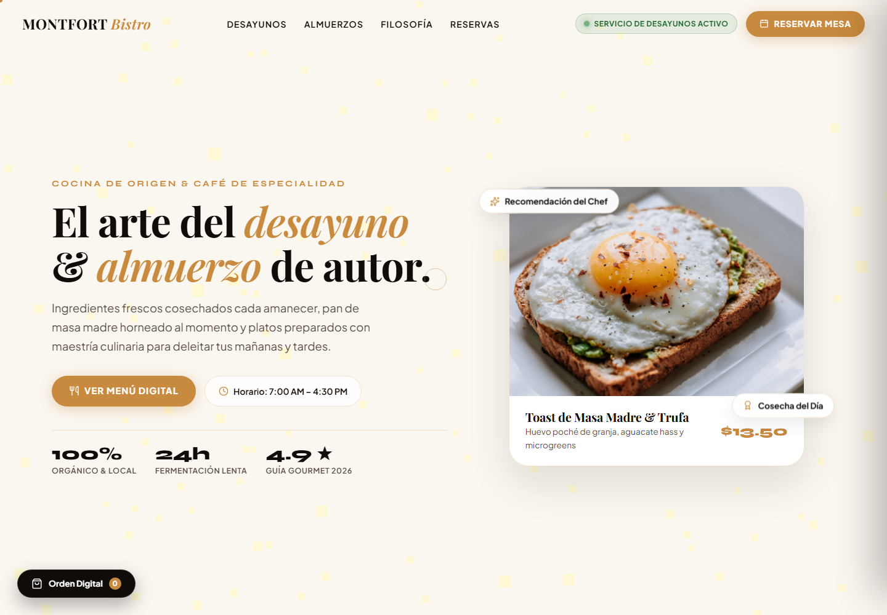

# Montfort Bistro



Sitio web responsive para un bistro, construido como una experiencia frontend ligera con menu, carrito local y formulario de reserva simulado.

## Funcionalidades

- Presentacion visual de marca para restaurante.
- Menu interactivo con platos y precios.
- Carrito local para simular una orden.
- Formulario de reserva de mesa.
- Servidor local simple en Node.js para revisar el proyecto sin configuraciones extra.

## Stack

- HTML5
- CSS3
- JavaScript
- Node.js para servidor local estatico

## Ejecutar localmente

Requiere Node.js instalado.

```bash
node server.js
```

Luego abre:

```txt
http://localhost:3000
```

Si el puerto `3000` esta ocupado, el servidor usa automaticamente el siguiente puerto disponible.

## Estructura

```txt
.
├── index.html
├── server.js
└── iniciar-servidor.bat
```

## Alcance

El proyecto es una demo frontend. No incluye pagos reales, reservas persistentes ni base de datos.
